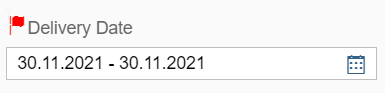

# Use Icon as Text

## where icon is not possible to add as control expects text only



As you can see that we are showing flag icon while the label control only allows to pass text in the 'text' attribute. This is achieved with CSS.

Here is how the view looks.

```
<Label class="myCustomIcon" text="Delivery Date"></Label>
```

The CSS is:

```
.myCustomIcon:before {
  content: "\e0aa";
  font-family: "SAP-icons";
  font-size: 15px;
  margin-left: 3px;
  margin-right: 3px;
  color: red;
}
```
